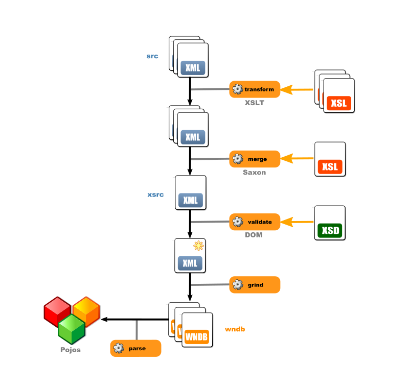

# English WordNet grinder

Refer to [globalwordnet/english-wordnet](https://github.com/globalwordnet/english-wordnet)
This is designed to produce __transformed__ English Wordnet data in the form of WordNet-format data in the __wndb__ directory

## WNDB grinder

[ewn-grind](https://github.com/1313ou/ewn-grind) 
This produces WNDB(5WN) format files from the merged XML file.

## Command line

`grind.sh [XSRCDIR] [OUTDIR]`

grind the WNDB database

`grind1.sh [XSRCDIR] [POS] [OFS]`

partially grind the WNDB database and output line at *offset* of *data.{noun|verb|adj|adv}*

`parse.sh [WNDBDIR]`

parse the WNDB database data

`parseIndex.sh [WNDBDIR]`

parse the WNDB database word index

`parseSenses.sh [WNDBDIR]`

parse the WNDB database sense index

`parse1.sh [WNDBDIR] [POS] [OFS]`

parse the WNDB database at expected *offset* of *data.{noun|verb|adj|adv}*

*where*

[XSRCDIR] xsrc directory where annotated XML files are

[POS]     n|v|a|r

[OFS]     offset

If WNHOME20, WNHOME21, WNHOME30, WNHOME31, WNHOMEXX environment variables are defined, you can refer to them by 20, 21, 30, 31, 00 respectively, instead of the full path.

## Lexid

The old specification defined lexids this way:

> One digit hexadecimal integer that, when appended onto lemma , uniquely
> identifies a sense within a lexicographer file. lex_id numbers usually
> start with 0 , and are incremented as additional senses of the word are
> added to the same file, although there is no requirement that the
> numbers be consecutive or begin with 0 . Note that a value of 0 is the
> default, and therefore is not present in lexicographer files.

This used to limit the number of senses to 16 per lexicographer file. Now the lexicographer files have changed formats and no longer use this scheme to distinguish senses. So the old lexid is left orphaned (it's a reference to something that no longer exists in the new lexicographer files).

WARNING 

Lexid is now defined as __the 1-based index of the sense__ in the lexicographer file.

The range is now not limited to [0-15] and can exceed it.

The __0 index__ is reserved to mean '*all senses*' in some contexts (likewise 0 means '*all members*' in some contexts).

The implication is that the lexid field after each lemma member in the data files can exceed one hexadecimal character. This does not seem to pose a problem for most parsers which assume a space-separated numerical field rather than a one-byte length one.

## Sensekeys

WARNING 

Sensekeys are __generated__.

__Each sense has a unique sensekey__ that works as an *inner* key to the database senses.

The PWN31 sensekeys are still available in the XML files but they are not used. They are considered __foreign__ keys.

Note that a sensemap can be generated by one of the XSL scripts, that maps a generated sensekey to a unique PWN31 sensekey, if it exists. The mapping is 1-1 but *sparse* due to every sense not having a PWN31 sensekey.

If the senses are not reordered in the XML source files, the same sensekeys will be generated, so it provides some stability.
